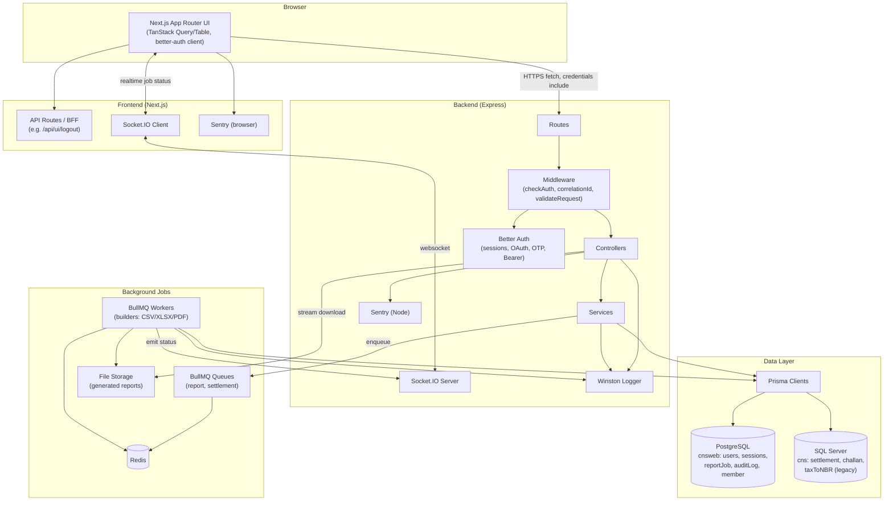
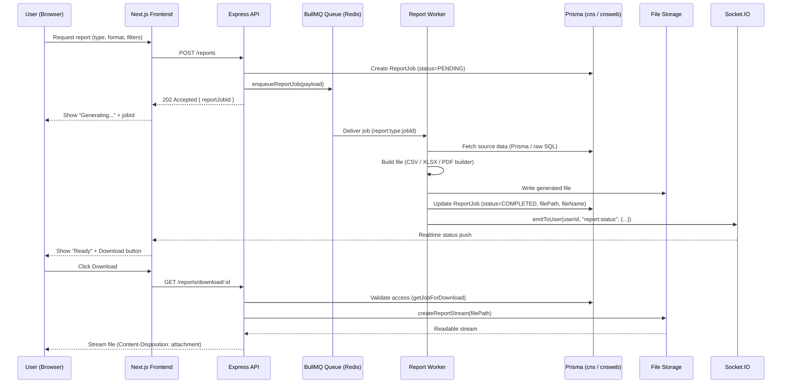
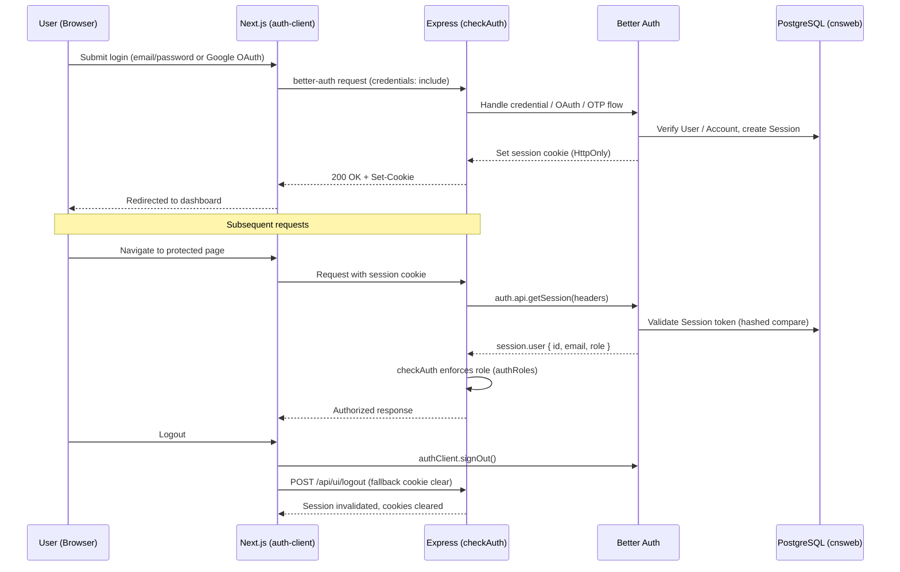

# CSE-CNS

A full-stack web application for CNS (Central Depository/Clearing) operations — member management, settlements, reconciliation, and tax report generation — built as a monorepo with a Next.js frontend and an Express/Prisma backend.

## Repository Structure
```
cse-cns/
  backend/     Express + TypeScript API, Prisma (dual DB), BullMQ workers, Socket.IO
  frontend/    Next.js (App Router) + TypeScript, TanStack Query/Table, better-auth client
  docs/        Consolidated project documentation (10 documents, see below)
  ai/          AI agent guidance docs (STACK, DOMAIN, ENGINEERING, PROJECT, PROMPT, UI, CLAUDE)
  utility/     Misc scripts/tools
```

## Tech Stack at a Glance
| Layer | Technology |
|---|---|
| Frontend | Next.js, React, TypeScript, Tailwind CSS, shadcn/ui, TanStack Query, TanStack Table |
| Backend | Node.js, Express, TypeScript |
| Database | PostgreSQL (`cnsweb` — app data) + SQL Server (`cns` — legacy trading data), via Prisma |
| Auth | Better Auth (email/password, Google OAuth, Email OTP, Bearer tokens, session cookies) |
| Jobs/Queue | BullMQ + Redis (report & settlement generation) |
| Realtime | Socket.IO |
| Logging | Winston (structured logs + audit trail) |
| Monitoring | Sentry (frontend + backend) |
| Package Manager | pnpm (workspace) |

## Getting Started

### Prerequisites
- Node.js (LTS), pnpm
- PostgreSQL instance (for `cnsweb`) and access to a SQL Server instance (for `cns`)
- Redis instance (for BullMQ + caching)

### Install
```cmd
cd backend && pnpm install
cd ..\frontend && pnpm install
```

### Environment
Each app (`backend/.env`, `frontend/.env`) requires its own environment variables (database URLs, `BETTER_AUTH_SECRET`, `BETTER_AUTH_URL`, `REDIS_URL`, `SENTRY_DSN`, Google OAuth credentials, etc.). See `backend/src/app/config/env.ts` for the full list of required backend variables.

### Run (development)
```cmd
cd backend && pnpm dev
cd ..\frontend && pnpm dev
```

See [`backend/README.md`](backend/README.md) and [`frontend/README.md`](frontend/README.md) for app-specific instructions.

## Architecture Diagram


## Report Generation Workflow


## Authentication Workflow


## Documentation
All project documentation is consolidated into 10 documents under [`docs/`](docs):

| # | Document | Covers |
|---|---|---|
| 1 | `01-FRONTEND-OVERVIEW.md` | Frontend architecture, structure, hooks, services |
| 2 | `02-BACKEND-OVERVIEW.md` | Backend architecture, modules, middleware |
| 3 | `03-API-REFERENCE.md` | All REST API endpoints |
| 4 | `04-LOGGING-WINSTON.md` | Winston logging & audit trail |
| 5 | `05-SENTRY-MONITORING.md` | Sentry error monitoring (frontend + backend) |
| 6 | `06-DATABASE-PRISMA.md` | Prisma schemas, models, raw SQL queries |
| 7 | `07-GENERIC-TABLE-TANSTACK.md` | Generic CRUD table (TanStack Table) |
| 8 | `08-REPORT-ENGINE-BULLMQ.md` | Report engine, BullMQ, streaming downloads |
| 9 | `09-AUTH-BETTER-AUTH.md` | Better Auth, JWT, cookies, tokens |
| 10 | `10-IMPLEMENTATION-STATUS.md` | Final project implementation status |

## Core Features
- **Role-based access** (ADMIN / TRECHOLDER) enforced at both route and table level
- **Generic data management** — any registered Prisma model gets CRUD UI/API for free
- **Async report generation** — CSV/XLSX/PDF exports (member lists, tax certificates) via BullMQ workers, delivered as streamed downloads with realtime status via Socket.IO
- **Reconciliation dashboards** — receivable, transaction, and cash-flow summaries via raw SQL against the legacy `cns` database
- **Secure authentication** — session-based via Better Auth, with OAuth and OTP support

## License
Internal/proprietary project.
