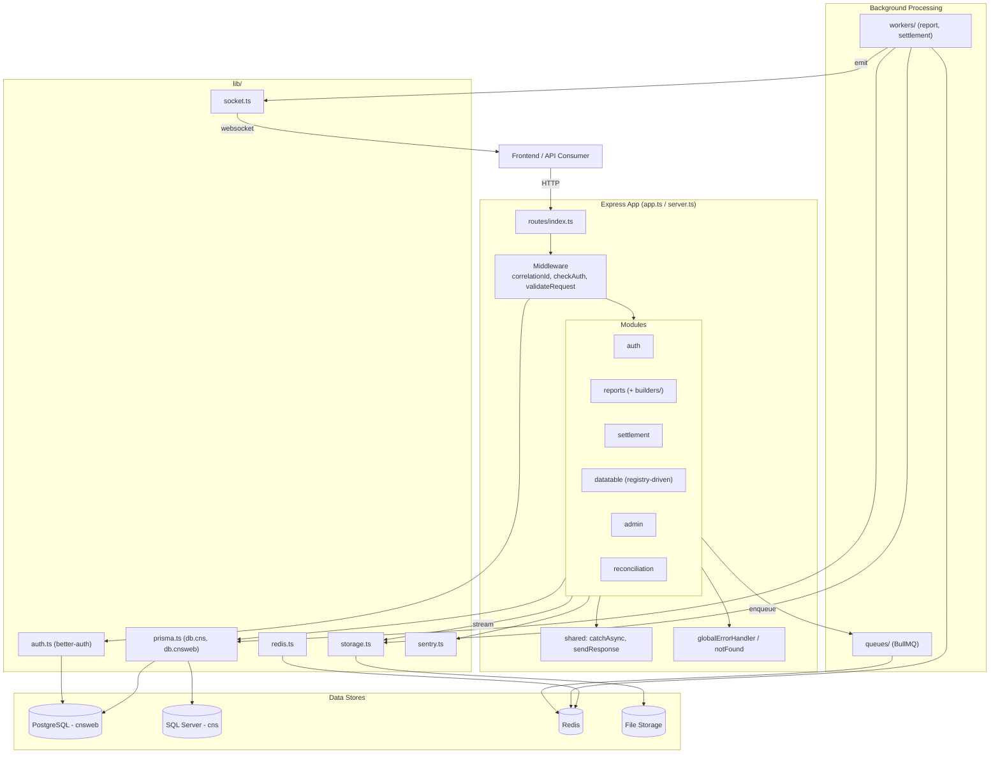
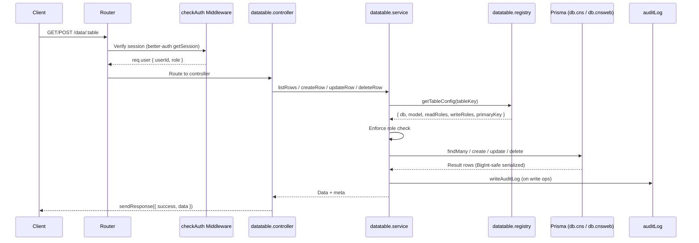
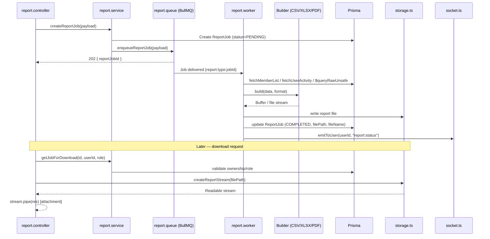

# CSE-CNS Backend

Express + TypeScript API server powering the CSE-CNS platform: authentication, generic data CRUD, report/settlement generation, and reconciliation reporting.

> For full architectural detail, see [`../docs/02-BACKEND-OVERVIEW.md`](../docs/02-BACKEND-OVERVIEW.md), [`../docs/03-API-REFERENCE.md`](../docs/03-API-REFERENCE.md), [`../docs/06-DATABASE-PRISMA.md`](../docs/06-DATABASE-PRISMA.md), [`../docs/08-REPORT-ENGINE-BULLMQ.md`](../docs/08-REPORT-ENGINE-BULLMQ.md), and [`../docs/09-AUTH-BETTER-AUTH.md`](../docs/09-AUTH-BETTER-AUTH.md).

## Stack
- Node.js + Express + TypeScript
- Prisma (dual clients: `cns` on SQL Server, `cnsweb` on PostgreSQL)
- Better Auth (email/password, Google OAuth, Email OTP, Bearer)
- BullMQ + Redis (background jobs for reports/settlements)
- Socket.IO (realtime job status)
- Winston (logging) + Sentry (monitoring)

## Directory Structure
```
src/
  app.ts / server.ts   Express app bootstrap & server entry
  config/               env.ts - environment variable loading
  errorHelpers/         AppError and error utilities
  lib/                  auth, prisma, redis, sentry, socket, storage
  middleware/           checkAuth, correlationId, globalErrorHandler, notFound, validateRequest
  modules/              admin, auth, datatable, reconciliation, reports, settlement
  queues/               BullMQ Queue definitions
  workers/              BullMQ worker processes
  routes/               central route mounting
  shared/               catchAsync, sendResponse
  utils/                logger, jwt, cookie, auditLog, email, QueryBuilder, seed
  generated/             Prisma-generated clients (cns, cnsweb)
prisma/
  cns/                  Legacy SQL Server schema (settlement, challan, taxToNBR)
  cnsweb/               Application PostgreSQL schema (auth, member, reportJob, auditLog) + migrations
```

## Prerequisites
- Node.js (LTS)
- pnpm
- PostgreSQL (for `cnsweb`)
- Access to SQL Server (for `cns`, legacy/introspected)
- Redis (BullMQ + caching)

## Setup
```cmd
pnpm install
```

Configure `.env` with (at minimum):
```
DATABASE_URL=...            # cnsweb (PostgreSQL)
CNS_DATABASE_URL=...        # cns (SQL Server)
REDIS_URL=...
BETTER_AUTH_SECRET=...
BETTER_AUTH_URL=...
GOOGLE_CLIENT_ID=...
GOOGLE_CLIENT_SECRET=...
SENTRY_DSN=...
NODE_ENV=development
```
See `src/app/config/env.ts` for the authoritative list.

## Database
Generate Prisma clients and run migrations for the `cnsweb` schema:
```cmd
pnpm exec prisma generate --config prisma.cnsweb.config.ts
pnpm exec prisma migrate dev --config prisma.cnsweb.config.ts
pnpm exec prisma generate --config prisma.cns.config.ts
```
The `cns` (SQL Server) schema is treated as an existing legacy database — no migrations are applied against it, only introspection/read/raw-query access.

## Run
```cmd
pnpm dev        REM start API server in watch mode
pnpm build      REM compile TypeScript
pnpm start      REM run compiled build
```

Background workers (report/settlement generation) run as part of the same process tree via `workers/report.worker.ts` and `workers/settlement.worker.ts` — ensure Redis is reachable before starting.

## Key Concepts
- **Generic CRUD:** New tables are exposed via `modules/datatable/datatable.registry.ts` — no new route/controller needed.
- **Auth:** Session cookies verified via `better-auth`'s `auth.api.getSession()` in `checkAuth` middleware; role-based route guards via `checkAuth(...roles)`.
- **Reports:** POST to `/reports` enqueues a BullMQ job; poll or subscribe via Socket.IO for status; download via `GET /reports/download/:id` (streamed).
- **Logging:** Use the shared `logger` from `utils/logger.ts` (Winston) instead of `console.log`.

## Logs
Written to `logs/error.log` and `logs/combined.log` at the project root.

## Architecture Diagram


## Request Lifecycle (Generic CRUD Example)


## Report Job Lifecycle

