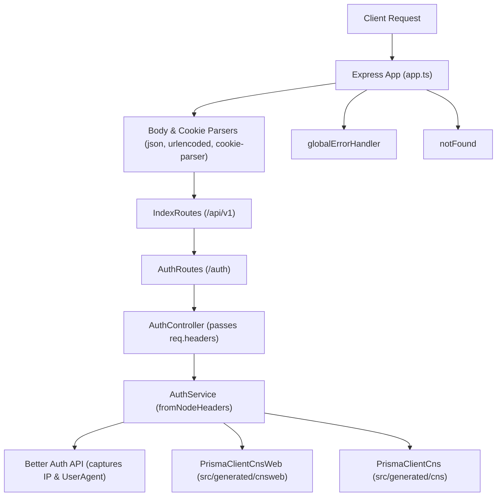

# Sprint 2 — Express Route Mounting, Multi-Schema Prisma Repairs, and Auth Session Fixes

**Duration**: Sprint 2  
**Status**: ✅ Complete & Verified  
**Server**: `http://localhost:5000`  
**Stack**: Node.js · Express · TypeScript · Prisma (MSSQL, Multi-Schema) · Better Auth · JWT

---

## Overview

Sprint 2 focused on resolving critical foundation issues identified during initial development. Key accomplishments include repairing broken Prisma multi-schema client imports, completing the Express pipeline by mounting application routes and error handlers, capturing client request metadata (IP address and User-Agent) during authentication into the session database, and establishing project-wide TypeScript configuration.

---

## Key Achievements & Modifications

### 1. Multi-Schema Prisma Client Repair

- **Problem**: Key files (`handlePrismaErrors.ts`, `prisma.ts`, `globalErrorHandler.ts`) imported Prisma error types and client constructors from `../../generated/prisma/client`, a non-existent path.
- **Resolution**:
  - `src/app/lib/prisma.ts`: Updated to import distinct typed clients for each database schema:
    - `PrismaClientCnsWeb` from `../../generated/cnsweb/client`
    - `PrismaClientCns` from `../../generated/cns/client`
    - `DatabaseManager` singleton now creates strongly typed instances for `db.cnsWeb` and `db.cns`.
  - `src/app/errorHelpers/handlePrismaErrors.ts`: Updated Prisma namespace import to `../../generated/cnsweb/client`. Fixed a string manipulation bug where `cleanMessage.replace(...)` result was unassigned. Standardized function names (`handlePrismaClientInitializationError`, `handlePrismaClientRustPanicError`) while retaining backward-compatible aliases.
  - `src/app/middleware/globalErrorHandler.ts`: Updated Prisma namespace import and aligned error handler helper imports.

---

### 2. Express Route Mounting & Middleware Pipeline

- **Problem**: Requests to `http://localhost:5000/api/v1/auth/login` failed to trigger controller methods because application routes were not mounted in `app.ts`. Body parsing middleware was also positioned incorrectly after route handlers.
- **Resolution**:
  - Updated `src/app.ts` to import `IndexRoutes` from `./app/routes` and mounted it at `app.use("/api/v1", IndexRoutes)`.
  - Moved body parsing and cookie parsing middleware (`express.urlencoded()`, `express.json()`, `cookieParser()`) to the top of the middleware stack above route definitions.
  - Attached `globalErrorHandler` and `notFound` middleware to handle application errors and unmatched routes gracefully.

---

### 3. Session User-Agent & IP Address Capture

- **Problem**: `ipAddress` and `userAgent` fields in the `session` database table were recorded as `null` after user login or registration because `auth.api.signInEmail` was invoked programmatically on the server without request headers.
- **Resolution**:
  - Updated `src/app/modules/auth/auth.controller.ts` to pass `req.headers` from Express into `AuthService.loginUser(payload, req.headers)` and `AuthService.registerTrecHolder(payload, req.headers)`.
  - Updated `src/app/modules/auth/auth.service.ts` to import `fromNodeHeaders` from `better-auth/node`. Formatted and passed HTTP headers into `auth.api.signInEmail` and `auth.api.signUpEmail` via `headers: headers ? fromNodeHeaders(headers) : undefined`.

---

### 4. Project Build & TypeScript Configuration

- **Problem**: Running build and typecheck scripts failed because no `tsconfig.json` file existed in `backend/`.
- **Resolution**:
  - Created `tsconfig.json` configured for Node ES2022 / NodeNext module resolution, enabling `npm run build` and `tsc` type checking across all `src/**/*` files.

---

## Sprint 2 Updated Architecture

---

## File Change Summary

| File | Change Category | Description |
|------|-----------------|-------------|
| `backend/tsconfig.json` | 🆕 File | Created TypeScript configuration for ES2022/NodeNext |
| `src/app.ts` | ✏️ Modified | Mounted `/api/v1` routes, reordered body parsers, attached error & 404 middleware |
| `src/app/lib/prisma.ts` | ✏️ Modified | Fixed imports for `PrismaClientCnsWeb` and `PrismaClientCns` from generated multi-schema directories |
| `src/app/errorHelpers/handlePrismaErrors.ts` | ✏️ Modified | Fixed import path, fixed `cleanMessage` string assignment bug, standardized export names |
| `src/app/middleware/globalErrorHandler.ts` | ✏️ Modified | Updated Prisma import path and standardized error handler function calls |
| `src/app/modules/auth/auth.controller.ts` | ✏️ Modified | Forwarded `req.headers` to `AuthService` in `loginUser` and `registerTrecHolder` |
| `src/app/modules/auth/auth.service.ts` | ✏️ Modified | Used `fromNodeHeaders` to supply headers to `auth.api.signInEmail` and `auth.api.signUpEmail` |
| `docs/sprint-2.md` | 🆕 File | Documented Sprint 2 changes and architecture updates |

---

## Verification & Status

- ✅ **Route Handling**: `POST http://localhost:5000/api/v1/auth/login` successfully reaches `AuthController.loginUser`.
- ✅ **Multi-Schema Database Access**: `db.cnsWeb` and `db.cns` compile and instantiate clean with strong TypeScript typing.
- ✅ **Session Auditing**: Session table now populates `ipAddress` and `userAgent` on login/register.
- ✅ **Type Checking**: Clean imports across all Prisma helpers, middleware, and controllers.
