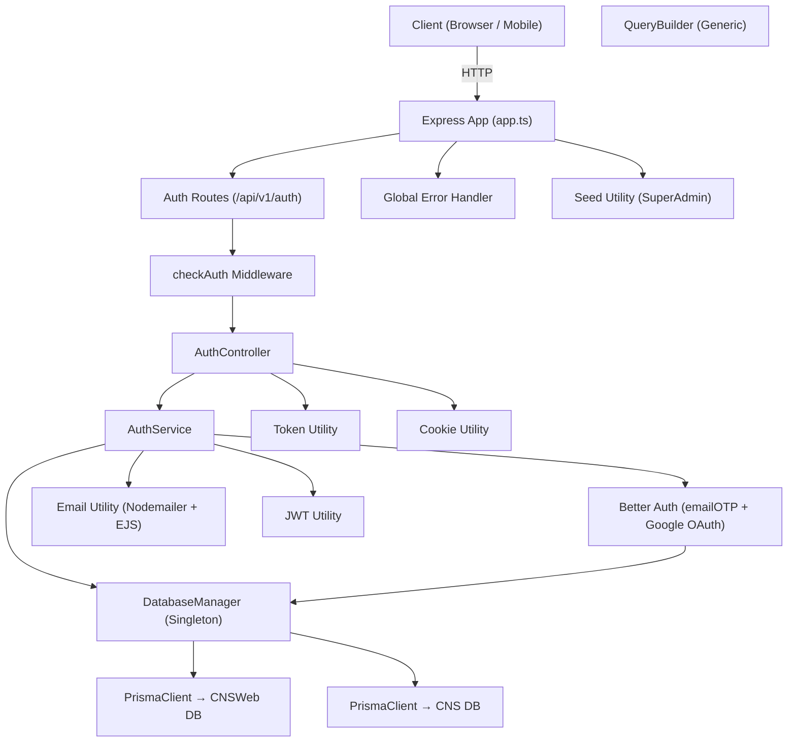

# Sprint 1 — CSE-CNS Backend Foundation

**Duration**: Sprint 1  
**Status**: ✅ Complete & Running  
**Server**: `http://localhost:5000`  
**Stack**: Node.js · Express · TypeScript · Prisma (MSSQL) · Better Auth · JWT

---

## Overview

Sprint 1 establishes the complete backend infrastructure for the CSE-CNS platform. This includes the multi-database connection layer, authentication system, middleware pipeline, error handling, and shared utilities that all future feature modules will build on.

---

## Architecture



---

## File Index

### Core Bootstrap

| File | Role |
|------|------|
| `src/server.ts` | Entry point — connects both DBs, seeds admin, starts HTTP server, handles SIGTERM/SIGINT |
| `src/app.ts` | Express app — CORS, JSON parsing, base route |

---

### Configuration

| File | Role |
|------|------|
| `src/app/config/env.ts` | Loads, validates, and exports all 23 env variables with type safety |
| `.env` | Environment variable definitions |

**Validated env variables:**

```
PORT, NODE_ENV
DATABASE_URL_CNSWEB, DATABASE_URL_CNS        ← both databases
BETTER_AUTH_SECRET, BETTER_AUTH_URL
BETTER_AUTH_SESSION_TOKEN_EXPIRES_IN, BETTER_AUTH_SESSION_TOKEN_UPDATE_AGE
ACCESS_TOKEN_SECRET, REFRESH_TOKEN_SECRET
ACCESS_TOKEN_EXPIRES_IN, REFRESH_TOKEN_EXPIRES_IN
EMAIL_SENDER_SMTP_USER/PASS/HOST/PORT/FROM
GOOGLE_CLIENT_ID, GOOGLE_CLIENT_SECRET, GOOGLE_CALLBACK_URL
FRONTEND_URL
ADMIN_EMAIL, ADMIN_PASSWORD
```

---

### Database Layer

| File | Role |
|------|------|
| `src/app/lib/prisma.ts` | `DatabaseManager` singleton + `db` export |
| `prisma/schema/schema.prisma` | Prisma generator config (MSSQL, output → `src/generated/prisma`) |
| `prisma/schema/auth.prisma` | User, Session, Account, Verification models |
| `prisma/schema/member.prisma` | TrecHolder, Doctor, Admin profile models |
| `prisma.config.ts` | Prisma CLI config — points to `DATABASE_URL_CNSWEB` |

#### `DatabaseManager` — Key Design

```typescript
import { db } from './app/lib/prisma';

// Access CNSWeb database
await db.cnsWeb.user.findMany();

// Access CNS database
await db.cns.someModel.findMany();

// Backward-compatible alias (existing code unchanged)
import { prisma } from './app/lib/prisma';
await prisma.user.findMany(); // → db.cnsWeb
```

- **Singleton pattern** — one instance across the process lifetime
- **`parseConnectionString()`** — parses `sqlserver://host:port;database=X;user=Y;password=Z` format
- **Dev-mode query logging** — emits query events in `development` only
- **`db.disconnect()`** — disconnects both clients simultaneously (called on SIGTERM/SIGINT)

---

### Authentication

| File | Role |
|------|------|
| `src/app/lib/auth.ts` | Better Auth configuration (email+password, Google OAuth, emailOTP plugin) |
| `src/app/auth/auth.service.ts` | Business logic for all auth operations |
| `src/app/auth/auth.controller.ts` | HTTP handlers — sets cookies, calls service |
| `src/app/auth/auth.route.ts` | Route definitions with role-based guards |
| `src/app/auth/auth.interface.ts` | TypeScript interfaces for auth payloads |

#### API Endpoints

| Method | Path | Auth Required | Description |
|--------|------|:---:|-------------|
| `POST` | `/api/v1/auth/register` | — | Register new TrecHolder (creates User + TrecHolder in transaction) |
| `POST` | `/api/v1/auth/login` | — | Email/password login |
| `GET`  | `/api/v1/auth/me` | ✅ All roles | Get current user profile with relations |
| `POST` | `/api/v1/auth/refresh-token` | — | Rotate access + refresh tokens via session |
| `POST` | `/api/v1/auth/change-password` | ✅ All roles | Change password, revokes other sessions |
| `POST` | `/api/v1/auth/logout` | ✅ All roles | Sign out, clears all 3 cookies |
| `POST` | `/api/v1/auth/forget-password` | — | Send OTP to email for password reset |
| `POST` | `/api/v1/auth/reset-password` | — | Reset password with OTP |
| `POST` | `/api/v1/auth/verify-email` | — | Verify email with 6-digit OTP |
| `GET`  | `/api/v1/auth/login/google` | — | Initiates Google OAuth (renders redirect page) |
| `GET`  | `/api/v1/auth/google/success` | — | OAuth callback — creates TrecHolder profile if new |
| `GET`  | `/api/v1/auth/oauth/error` | — | OAuth error redirect handler |

#### Token Strategy

Three tokens are issued and stored as `httpOnly` cookies on login/register:

| Cookie | Expiry | Purpose |
|--------|--------|---------|
| `accessToken` | 1 day | JWT — used for route authorization |
| `refreshToken` | 7 days | JWT — used to rotate access token |
| `better-auth.session_token` | 1 day | Better Auth session — used for session DB checks |

#### User Roles

```typescript
enum UserRole {
  ADMIN       = 'ADMIN',
  TRECHOLDER  = 'TRECHOLDER'   // default for new signups
}
```

#### User Statuses

```typescript
enum UserStatus { ACTIVE, BLOCKED, DELETED }
```

---

### Middleware

| File | Role |
|------|------|
| `src/app/middleware/checkAuth.ts` | Dual-layer auth guard — validates session token from DB + verifies JWT access token |
| `src/app/middleware/globalErrorHandler.ts` | Catches all errors, normalizes to structured JSON response |
| `src/app/middleware/validateRequest.ts` | Zod schema validation middleware |
| `src/app/middleware/notFound.ts` | 404 handler |

#### `checkAuth` Logic

```
1. Read better-auth.session_token cookie
2. Look up session in DB → verify not expired
3. Check user status (BLOCKED / DELETED / isDeleted guard)
4. Check role against allowed roles
5. If session < 20% lifetime remaining → set X-Session-Refresh header
6. Read accessToken cookie → verify JWT signature
7. Re-check role from JWT payload
8. Attach req.user = { userId, email, role }
```

---

### Error Handling

| File | Role |
|------|------|
| `src/app/errorHelpers/AppError.ts` | Custom error class with `statusCode` |
| `src/app/errorHelpers/handlePrismaErrors.ts` | Handles all 5 Prisma error types with normalized messages |
| `src/app/errorHelpers/handleZodError.ts` | Flattens Zod validation errors into structured array |

**Error response shape:**

```json
{
  "success": false,
  "message": "Human-readable message",
  "errorSources": [{ "path": "field", "message": "what went wrong" }],
  "stack": "...only in development",
  "error": "...only in development"
}
```

---

### Utilities

| File | Role |
|------|------|
| `src/app/utils/QueryBuilder.ts` | Generic, chainable Prisma query builder with search, filter, sort, paginate, include |
| `src/app/utils/jwt.ts` | `createToken` / `verifyToken` wrappers |
| `src/app/utils/token.ts` | `getAccessToken`, `getRefreshToken`, cookie setters |
| `src/app/utils/cookie.ts` | `setCookie` / `getCookie` / `clearCookie` |
| `src/app/utils/email.ts` | Nodemailer + EJS template email sender |
| `src/app/utils/seed.ts` | Seeds Super Admin on first boot (idempotent) |

#### `QueryBuilder` — Usage Pattern

```typescript
const result = await new QueryBuilder(prisma.TrecHolder, req.query, {
    searchableFields: ['name', 'email'],
    filterableFields: ['status', 'user.role'],
})
    .search()
    .filter()
    .sort()
    .paginate()
    .include({ user: true })
    .execute();

// result = { data: trecHolder[], meta: { page, limit, total, totalPages } }
```

**Supported filter operators via query string:**

```
?name=John                        → exact / parsed
?appointmentFee[lt]=100           → range filter
?appointmentFee[gte]=50           → range filter
?status=true / false              → boolean parsing
?user.name=John                   → nested relation filter (depth 2)
?specialities.speciality.title=X  → nested relation filter (depth 3)
?sortBy=user.name&sortOrder=asc   → nested sort
?page=2&limit=20                  → pagination
?fields=id,name,email             → field projection (disables include)
?include=appointments,reviews     → dynamic relation loading
```

---

### Email Templates

Templates are EJS files resolved at runtime from:

```
src/app/templates/<templateName>.ejs
```

Currently used template: `otp.ejs` — sent for email verification and password reset.

---

## Key Design Decisions

| Decision | Rationale |
|----------|-----------|
| **`DatabaseManager` singleton** | Prevents multiple connection pools; both DBs accessible from a single import |
| **Dual-token auth** (JWT + Better Auth session) | JWT for stateless speed; session DB check for instant revocation on block/delete |
| **`prisma` backward alias** | Existing code continues to work without any changes; migration is non-breaking |
| **`checkAuth` as a higher-order function** | `checkAuth(UserRole.ADMIN, UserRole.DOCTOR)` — role list is variadic, readable at route definition |
| **Generic `QueryBuilder`** | One class handles search/filter/sort/paginate for any Prisma model, reducing boilerplate per module |
| **EJS email templates** | Decouples email HTML from service logic; easy to style without redeployment |
| **OTP via Better Auth emailOTP plugin** | 6-digit, 2-minute expiry; admin users skip OTP send silently |

---

## Startup Sequence

```
tsx watch src/server.ts
  │
  ├── loadEnvVariables()          → validates all 23 env vars
  ├── db.cnsWeb.$connect()        → connects CNSWeb SQL Server
  ├── db.cns.$connect()           → connects CNS SQL Server
  ├── ✅ Both databases connected
  ├── seedSuperAdmin()            → creates admin if not exists (idempotent)
  └── app.listen(5000)            → server ready
```

---

## Known Issues / Todo for Sprint 2

> **Note:** The following items were identified during Sprint 1 and are deferred.

- [ ] `auth.ts` passes `provider: "postgresql"` to the Prisma adapter — should be `"sqlserver"` to match actual DB
- [ ] `registerTrecHolder` in `auth.service.ts` imports `{ email }` from `"zod"` (unused import — lint warning)
- [ ] `auth.controller.ts` imports `{ log }` from `"node:console"` (unused import)
- [ ] `checkAuth.ts` still imports `prisma` (alias) — can be updated to `db.cnsWeb` for clarity
- [ ] `seed.ts` still imports `prisma` (alias) — same as above
- [ ] No route file imported in `app.ts` yet — auth routes need to be mounted
- [ ] No Zod validation schemas defined yet for auth request bodies
- [ ] Google OAuth `callbackUrl` is commented out in `auth.ts`
- [ ] Session lifetime calculation uses `60 * 60 * 60 * 24` (3600 hours) — likely should be `60 * 60 * 24` (86400 seconds)
