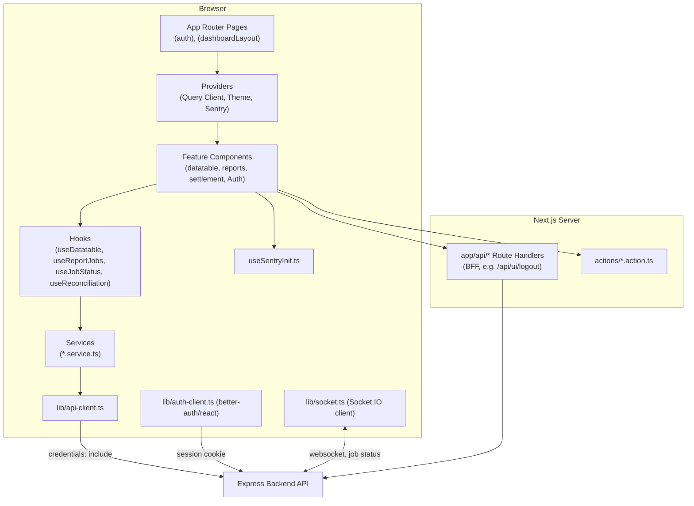
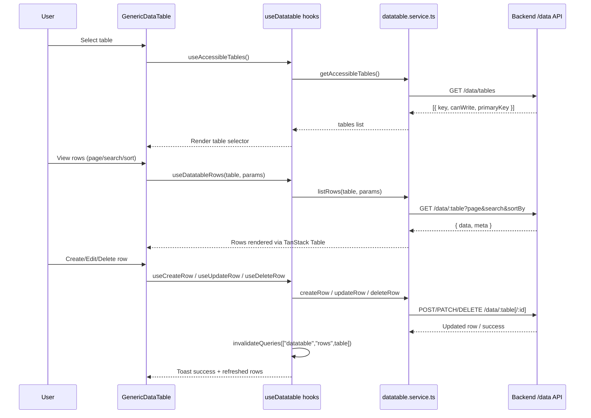
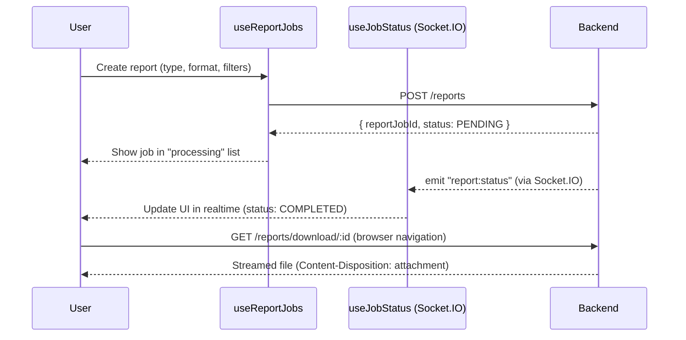

# CSE-CNS Frontend

Next.js (App Router) + TypeScript frontend for the CSE-CNS platform: authentication UI, generic data management tables, report generation UI, settlement/reconciliation dashboards.

> For full architectural detail, see [`../docs/01-FRONTEND-OVERVIEW.md`](../docs/01-FRONTEND-OVERVIEW.md), [`../docs/07-GENERIC-TABLE-TANSTACK.md`](../docs/07-GENERIC-TABLE-TANSTACK.md), [`../docs/08-REPORT-ENGINE-BULLMQ.md`](../docs/08-REPORT-ENGINE-BULLMQ.md), and [`../docs/09-AUTH-BETTER-AUTH.md`](../docs/09-AUTH-BETTER-AUTH.md).

## Stack
- Next.js (App Router), React, TypeScript
- Tailwind CSS + shadcn/ui
- TanStack Query (server state) + TanStack Table (data grids)
- `better-auth/react` (auth client)
- Socket.IO client (realtime job status)
- Sentry (browser monitoring) + Web Vitals

## Directory Structure
```
src/
  actions/       Server actions
  app/           App Router routes: (auth), (dashboardLayout), api, debug
  components/
    modules/     Feature components (admin, datatable, reports, settlement, Auth, login, dashboard)
    providers/   App-wide providers (query client, theme, sentry)
    shared/      Layout components (navbar, footer, error-boundary, logout-button)
    ui/          shadcn/ui primitives
  constants/     Static config (reportConstants, roles)
  hooks/         useDatatable, useBulkActions, useReconciliation, useReportJobs, useJobStatus, useSentryInit, useWebVitals
  lib/           api-client, auth-client, socket, error helpers
  services/      Typed API service wrappers (admin, datatable, reconciliation, report, settlement, trecholder, user)
  types/         Shared TypeScript types
  utils/         Utility helpers (tanstack-table-helpers, etc.)
  zod/           Validation schemas
```

## Prerequisites
- Node.js (LTS)
- pnpm
- Running backend API (see `../backend/README.md`)

## Setup
```cmd
pnpm install
```

Configure `.env` with (at minimum):
```
NEXT_PUBLIC_BASE_URL=http://localhost:5000
NEXT_PUBLIC_SENTRY_DSN=...
```

## Run
```cmd
pnpm dev        REM start dev server (http://localhost:3000)
pnpm build      REM production build (also runs Sentry source-map upload via sentry.config.ts)
pnpm start      REM run production build
pnpm lint       REM ESLint
```

## Key Concepts
- **Auth:** `lib/auth-client.ts` uses `credentials: "include"` so session cookies are sent to the backend. Use `signOutUser()` for logout (clears session + calls `/api/ui/logout` fallback).
- **Generic Data Table:** `components/modules/datatable/GenericDataTable.tsx` + `hooks/useDatatable.ts` render CRUD UI for any backend-registered table without custom per-table code.
- **Reports:** `hooks/useReportJobs.ts` creates/lists report jobs; `hooks/useJobStatus.ts` subscribes to realtime Socket.IO status updates; downloads link directly to the backend's streaming endpoint.
- **Monitoring:** `hooks/useSentryInit.ts` initializes Sentry on the client; errors also surface through `app/error.tsx`, `app/global-error.tsx`, and `components/shared/error-boundary.tsx`.

## Notes
- Uses pnpm workspaces (`pnpm-workspace.yaml`) alongside the backend.
- `components.json` configures shadcn/ui component generation conventions.

## Architecture Diagram


## Data Fetching & CRUD Workflow (Generic Table)


## Report Download Workflow


## Deploy on Vercel

The easiest way to deploy your Next.js app is to use the [Vercel Platform](https://vercel.com/new?utm_medium=default-template&filter=next.js&utm_source=create-next-app&utm_campaign=create-next-app-readme) from the creators of Next.js.

Check out our [Next.js deployment documentation](https://nextjs.org/docs/app/building-your-application/deploying) for more details.
